# 前言
紙本筆記轉數位化，縮減字數，罰則整理，以消防設備師大綱為主，不知何時可以考，但是當作練習Markdown及PlantUML。

# 消防法


## 第 1 條 `立法目的及適用範圍`
為`預防火災`、`搶救災害及緊急救護`，以維護公共安全，確保人民生命財產。
## 第 2 條 `管理權人之定義`
管理權人係指依`法令`或`契約`對各該場所有`實際支配管理權者`；其屬`法人者`，為其`負責人`。


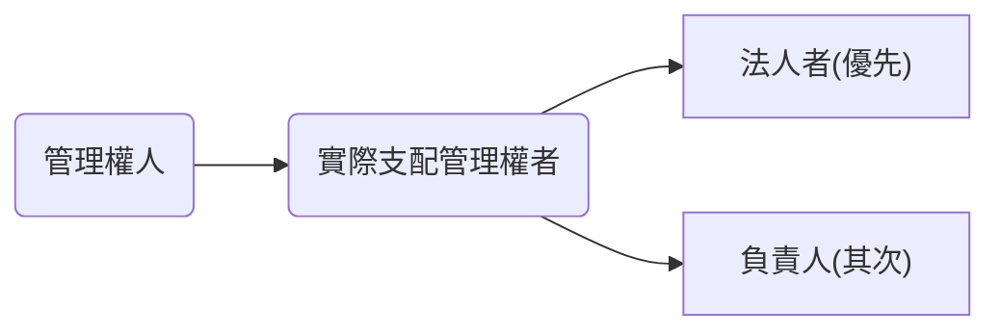
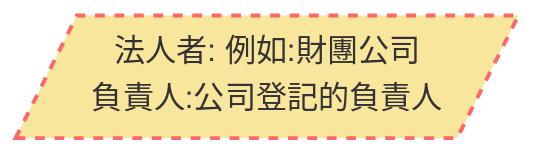

## 第 3 條 `主管機關`
消防主管機關：`中央為內政部`；`直轄市為直轄市政府`；`縣（市）為縣（市）`政府。
## 第 5 條 `防火教育及宣導`
直轄市、縣（市）政府，應`每年`定期舉辦`防火教育及宣導`，並由機關、學校、團體及大眾傳播機構協助推行。
## 第 6 條 `消防安全設備之設置`
1. 本法所定各類場所之`管理權人對其實際支配管理之場所`，應`設置並維護`其消防安全設備；場所之`分類`及消防安全設備設置之標準，由中央主管機關定之。
2. 消防機關得依前項所定各類場所之`危險程度`，`分類列管檢查及複查`。
3. 第一項所定各類場所因用途、`構造特殊`，或引用與依第一項所定標準同等以上效能之技術、`工法或設備者`，得檢附具體證明，經中央主管機關核准，不適用依第一項所定標準之全部或一部。
    ```mermaid
    graph LR
        id1[/"85大樓、南港101大樓都屬於特殊構造、樓層已超過法規所定的樓層"/]
        style id1 fill:#f7e69c,stroke:#f66,stroke-width:2px,stroke-dasharray: 5, 5    
    ```   
4. `不屬於`第一項所定標準`應設置火警自動警報設備`之`旅館`、`老人福利機構場`所及中央主管機關公告場所之`管理權人`，`應`設置`住宅用火災警報器並維護`之；其安裝位置、方式、改善期限及其他應遵行事項之辦法，由中央主管機關定之。
5. `不屬於`第一項所定標準`應設置火警自動警報設備住宅場所之管理權人`，應設置`住宅用火災警報器並維護`之；其安裝位置、方式、改善期限及其他應遵行事項之辦法，由中央主管機關定之。

- 罰則
依第六條第一項所定標準`應設置消防安全設備之供營業使用場所`，或依同條第四項所定`應設置住宅用火災警報器之場所`，其`管理權人未依規定設置或維護`，於發生`火災`時`致人於死者`，處`一年以上七年`以下有期徒刑，得併科新臺幣`一百萬元以上五百萬元`以下罰金；致`重傷`者，處`六月以上五年`以下有期徒刑，得併科新臺幣`五十萬元以上二百五十`萬元以下罰金。
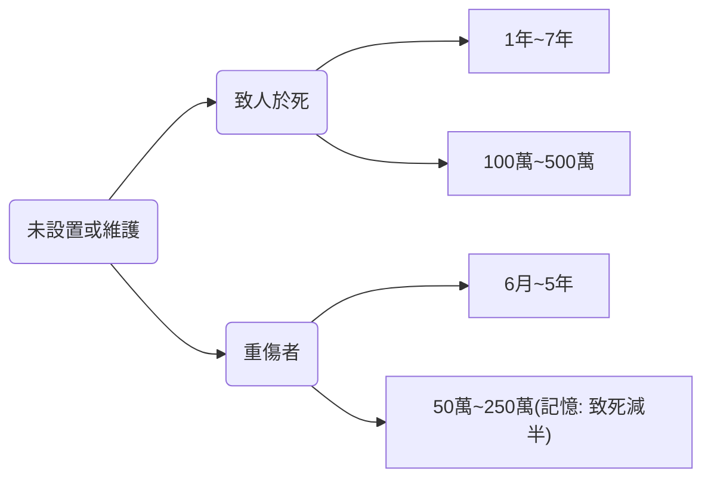
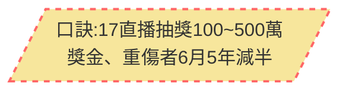

## 第 7 條 `消防安全設備`
1. 依各類場所消防安全設備設置標準設置之消防安全設備，其`設計、監造應由消防設備師為之`；其`裝置、檢修應由消防設備師或消防設備士為之`。
2. 前項消防安全設備之設計、監造、裝置及檢修，於消防設備師或消防設備士未達定量人數前，得由現有相關專門職業及技術人員或技術士暫行為之；其期限由中央主管機關定之。
消防設備師之資格及管理，另以法律定之。
3. 在前項法律未制定前，中央主管機關得訂定消防設備師及消防設備士管理辦法。


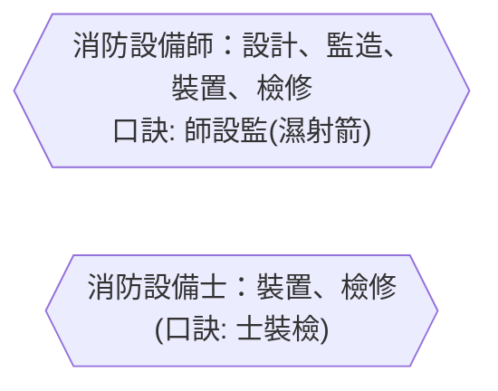

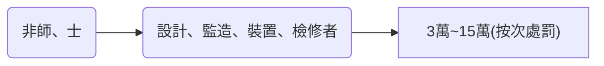


## 第 8 條 `消防設備師、消防設備士之資格`
中華民國國民經消防設備師考試及格並依本法領有消防設備師證書者，得充消防設備師。
中華民國國民經消防設備士考試及格並依本法領有消防設備士證書者，得充消防設備士。
請領消防設備師或消防設備士證書，應具申請書及資格證明文件，送請中央主管機關核發之。

## 第 9 條 `消防安全設備之定期檢修`
依第六條第一項應設置消防安全設備場所，其`管理權人應委託第八條所規定之消防設備師或消防設備士`，`定期檢修消防安全設備`，其檢修結果應依限`報請當地消防機關備查`；消防機關得視需要派員複查。但`高層建築物或地下建築物消防安全設備之定期檢修`，其`管理權人應委託中央主管機關許可之消防安全設備檢修專業機構辦理`。

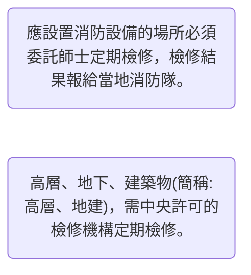

前項定期檢修消防安全設備之項目、方式、基準、期限、檢修結果報請備
查期限及其他應遵行事項之辦法，由中央主管機關定之。
第一項所定消防安全設備檢修專業機構，其申請許可之資格、程序、應備文件、證書核（換）發、有效期間、撤銷、廢止、執行業務之規範、消防設備師（士）之僱用、異動、訓練、業務相關文件之備置與保存年限、各類書表之陳報及其他應遵行事項之辦法，由中央主管機關定之。

* 罰則
違反第九條第一項規定者`(沒有找師士檢修)`，處其`管理權人`新臺幣`一萬元以上五萬元`以下罰鍰，並通知`限期改善`；屆期`未改善`者，得`按次處罰`。<br>
中央主管機關許可之消防安全設備`檢修專業機構`、消防設備`師`或消防設備`士`，未依第九條第二項所定辦法中有關定期檢修項目、方式、基準、期限之規定檢修消防安全設備或為消防安全設備`不實檢修`報告者，處新臺幣`二萬元以上十萬`元以下罰鍰，並得`按次處罰`；`必要時，並得予以一個月以上一年以下停止執行業務或停業之處分`。<br>
中央主管機關許可之消防安全設備`檢修專業機構`違反第九條第三項所定辦法中有關`執行業務之規範`、消防設備師（士）之`僱用、異動、訓練、業務相關文件之備置、保存年限、各類書表陳報`之規定者，處新臺幣`三萬元以上十五萬元`以下罰鍰，並`通知限期改善`；屆期`未改善`者，得`按次處罰`，並得`予以三十日以下之停業處分或廢止其許可`。


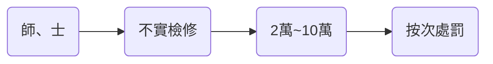
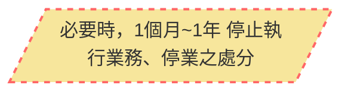

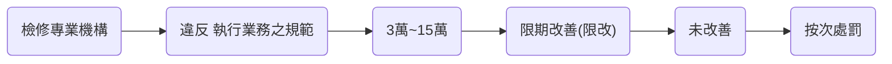
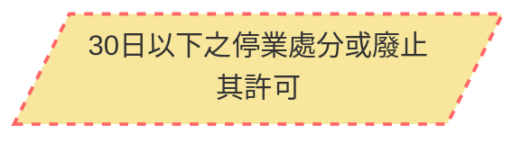

## 第10條 `消防安全設備圖說之審查`
供公眾使用建築物之消防安全設備圖說，應由直轄市、縣（市）`消防機關`於主管建築機關`許可開工前`，審查完成。
依建築法第三十四條之一申請預審事項，涉及建築物消防安全設備者，主管建築機關應會同消防機關預為審查。
`非供公眾使用建築物變更為供公眾使用`或`原供公眾使用建築物變更為他種公眾使用`時，主管建築機關應會同消防機關審查其消防安全設備圖說。

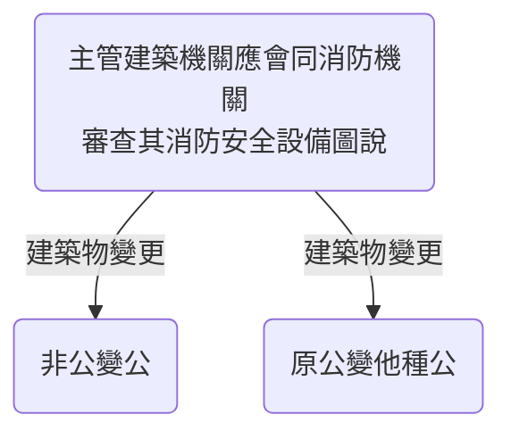


* 消防機關辦理建築物消防安全設備審查及查驗作業基準
    * 建築物消防安全設備圖說審查作業程序如下：
        1. 起造人填具申請書（如表一），檢附建築、消防圖說、建造執照申請書、消防安全設備概要表（如表一之一至表一之二十一）、相關證明文件資料等，向當地消防機關提出。其中消防圖說由消防安全設備設計人依滅火設備、警報設備、避難逃生設備、消防搶救上之必要設備等之順序依序繪製並簽章，圖說內所用標示記號，依消防圖說圖示範例（如表二）註記。
        2. 消防機關受理申請案於掛號分案後，即排定審查日期，通知該件建築物起造人及消防安全設備設計人，並由消防安全設備設計人攜帶其資格證件及當地建築主管機關審訖建築圖說，配合審查（申請案如係分別向建築及消防機關申請者，其送消防機關部分，得免檢附審訖建築圖說），消防安全設備設計人無正當理由未會同審查者，得予退件。但變更設計或變更用途，非系統式設備僅變動滅火器、緊急照明燈等簡易設備者，設計人得免配合審查。
        3. 消防圖說審查不合規定者，消防機關應製作審查紀錄表（如表三），依第六點規定之期限，將不合規定項目詳為列舉一次告知起造人，起造人於修正後應將消防圖說送回消防機關複審，複審程序準用前款之規定，其經複審仍不符合規定者，消防機關得將該申請案函退。
        4. 消防機關審訖消防圖說後，其有修正者，交消防安全設備設計人攜回清圖修正藍曬。消防圖說經審訖修改完成，送消防機關加蓋驗訖章後，消防機關留存一份，餘交起造人（即申請人）留存。
        5. 消防圖說審查作業流程如圖一。
            暫時不整理圖
            https://law.nfa.gov.tw/MOBILE/lawfile_list.aspx?lsid=FL019489&no=2
    * 建築物消防安全設備竣工查驗程序如下：
        1. 起造人填具申請書（如表四），檢附消防安全設備測試報告書（應由消防安全設備裝置人於各項設備施工完成後依報告書內項目實際測試其性能，並填寫其測試結果；如表四之一）、安裝施工測試照片（如表四之二）、證明文件（含審核認可書等）、使用執照申請書、原審訖之消防圖說等，向當地消防機關提出，資料不齊全者，消防機關通知限期補正。
        2. 消防機關受理申請案於掛號分案後，即排定查驗日期，通知該件建築物之起造人及消防安全設備裝置人，並由消防安全設備裝置人攜帶其資格證件至竣工現場配合查驗，消防安全設備裝置人無正當理由未會同查驗者，得予退件。
        3. 竣工現場消防安全設備查驗不合規定者，消防機關應製作查驗紀錄表（如表五），依第六點規定之期限，將不合規定項目詳為列舉一次告知起造人，起造人於完成改善後應通知消防機關複查，複查程序準用前款之規定，其經複查仍不符合規定者，消防機關得將該申請案函退。
        4. 竣工現場設置之消防安全設備與原審訖消防圖說之設備數量或位置有異動時，於不影響設備功能及性能之情形下，得直接修改竣工圖（另有關建築部分之立面、門窗、開口等位置之變更如不涉面積增減時，經建築師簽證後，亦得一併直接修改竣工圖），並於申請查驗時，備具完整竣工消防圖說，一次報驗。
        5. 消防機關完成建築物消防安全設備竣工查驗後，其須修正消防圖說者，消防安全設備設計人、監造人應將原審訖之消防圖說清圖修正製作竣工圖。完成竣工查驗者，其消防圖說應標明「竣工圖」字樣，送消防機關加蓋驗訖章後，消防機關留存二份列管檢查，餘交起造人（即申請人）留存。
        6. 建築物消防安全設備竣工查驗作業流程如圖二。
            圖二暫不整理
            https://law.nfa.gov.tw/MOBILE/lawfile_list.aspx?lsid=FL019489&no=6
## 第11條 `防焰物品之使用`
* `地面樓層達十一層以上建築物、地下建築物`及中央主管機關指定之場所，其`管理權人應使用附有防焰標示之地毯、窗簾、布幕、展示用廣告板`及其他指定之防焰物品。
* 前項防焰物品或其材料`非附有防焰標示`，`不得`銷`售`及陳`列`。
　　前二項防焰物品或其材料之防焰標示，應經中央主管機關認證具有防焰性能。